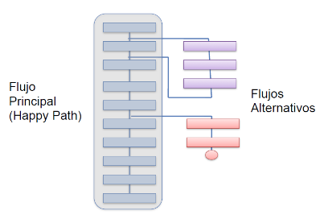
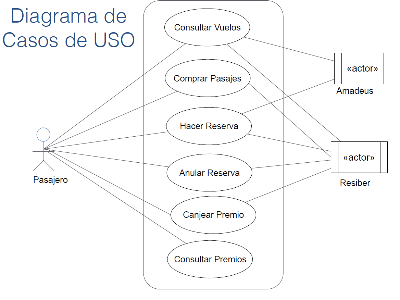
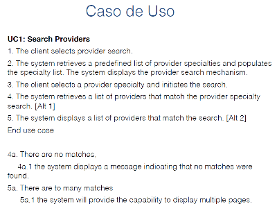
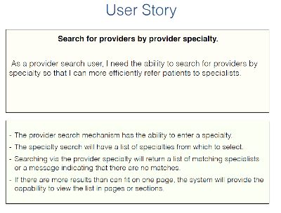
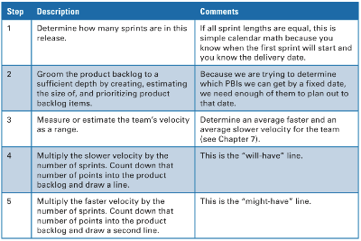
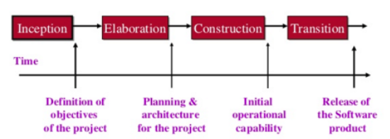
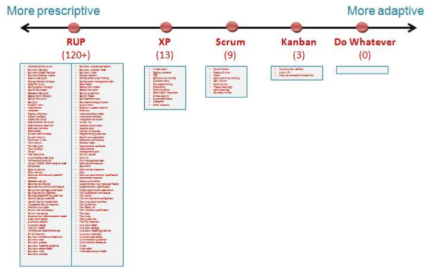

# Estimaciones

Para estimar el tiempo que tomará el desarrollo se puntúan las user stories. No se hace en escala lineal, sino que en fibonacci o en potencias de 2 porque el esfuerzo no es lineal.

## Ajustes:

- Por features: Se implementan menos features.
- Por recursos: Se completan todos los features, pero se contrata más gente o se demora más tiempo.

## Recolección de información para tomar decisiones

- de lineas de código al terminar
- esfuerzo en persona y meses

## Estimando

### Por analogía:

Se comparan dos proyectos similares

### Hacer dos estimaciones:

Por cada item hacer dos estimaciones: best case y worst case. Generalmente, al hacer solo una está muy cerca del best case.

# Casos de uso/User cases (UC)

Es toda una situación de uso de la app por un usuario. Son más generales que las user stories. Puede tener ramificaciones

Se especifican las personas y sistemas involucrados a cada lado del diagrama UML.

Ejemplo:  

# Planficación

## Distintos niveles

- **Portafolio:**
- Cuando se tienen múltiples productos, se decide en qué orden desarrollarlos, si extender existentes o comenzar nuevos, etc.
- **Producto:**
- Se parte desde el backlog del producto. Sigue una visión, en una frase que se espera que haga el producto.
- **Release:**
- Puede hacerse junto con cada feature, sprint o luego de varios sprints.

## Según fecha fija

La fecha es fija, puede variar el número de features que se logren. Se intenta estimar lo que se logrará de todas maneras con una cota superior e inferior. 

## Según features fijos

Puede extenderse el plazo, pero deben lograrse todos los features. Usando información de la velocidad de desarrollo de sprints anteriores se estima la cantidad de sprints mínima y máxima que tomará desarrollar la lista de features.

# Otras estrategias

## Prototipos

Se crea una versión de desarrollo muy rápido de la aplicación en un lenguaje de alto nivel solo para asegurar el entendimiento de los requisitos del cliente. Asi no se pierde tiempo desarrollando algo que luego el cliente no querrá. **Problemas** Puede generar expectativas de que el software está casi listo.

## Proceso unificado

Se trabaja en 4 fases:

 Es iterativo pero no incremental. En cada una de las etapas se puede hacer analisis, desarrollo,

## Kanban

Se visualiza el proceso de trabajo escribiendo tareas en post-its. Se van ubicando en 3 columnas: To do, Work in progress (WIP) y Done. Se limita el número de tareas WIP y se va registrando el tiempo que toma hacerlas. Luego se optimiza para reducir ese tiempo. En Kanban el board es permanente, a diferencia de SCRUM que se resetea luego de cada sprint. Un problema de Kanban es que como no pueden haber más de dos cosas WIP a la vez no se aprovecha a todo el equipo.

## Comparación de las distintas metodologías

