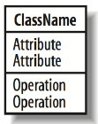
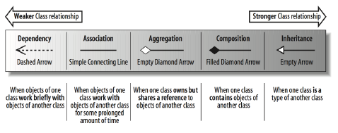
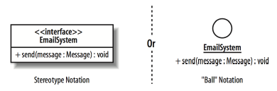
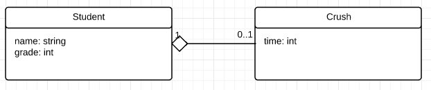
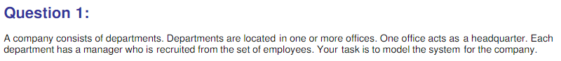
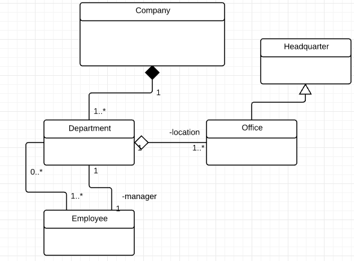

# Por estudiar:

- Programar un ejemplo en ruby para cada patrón de diseño
- UML

# Herramientas útiles

- [Draw.io](www.draw.io): Hacer UML
- [LucidChart](www.lucidchart.com): Otro para UML

# Preguntas:

- El patrón Composite se usa solo cuando hay métodos en común o también si hay solo variables. Ej: Todos los objetos de una casa tienen una variable precio. O solo cuando tienen una acción común (Ej: Precio en USD)
- No entiendo diferencia entre patrón `Component` y `Comando`. Comando incluye el patrón component?

# Patrones de diseño:

## Template Method

Considera la escalabilidad del código. Se hace algo en forma de `template`, sin amarrarlo a un lenguaje de programación particular.

Ej: Si se quiere generar un archivo con un reporte de erroes que tiene cierta estructura, pero se quiere dejar abierta la posiblidad de que el output sea un pdf/html/txt. Cada informe tendrá un título y un cuerpo.

```ruby
class Informe
  def generarInforme():
    titulo()
    cuerpo()
  end
end
```

Luego las otras clases heredan de `informe` y asi uno sabe que siempre puede usar el método generarInforme()

## Strategy

Es similar a template method, pero no depende de herencia. La clase es la que se encarga de hacer las acciones.

```ruby
class Informe
  def initialize(formatter):
    @formatter = formatter
  end
  def generarInforme():
    @formatter.generarInforme()
  end
end
```

Luego uno crearía un objeto `formatter` e instanciaria la clase `Informe` guardando el `formatter` en la variable `@formatter` de la instancia.

## Composite

Se usa cuando hay una estructura jerarquica en la que una subestructura se maneja igual que una la estructura completa.

```ruby
class ComponenteGrafico
  def draw():
  end
  def undo():
  end
  def rotate():
  end
  de scale():
  end
end

class graficoGrande < ComponenteGrafico
```

Component es una interfaz, una serie de "capacidades" que tiene un objeto. Luego hago que cada objeto que tiene que ser dibujado implemente la interfaz. No quiere decir que hereden el método tal y como está. Cada heredero se encarga de que ese método funcione.

## Comando

Consiste en convertir almacenar acciones como objetos.

Ej: Quiero implementar el método undo(). Para hacerlo guardo cada una de las acciones como un objeto y luego las ejecuto en orden inverso.

```ruby
class Comando
  def initialize(description)
    @description = description
  end

  def execute
  end

end

class CrearArchivo
  def initialize(path)
    super("Crea un archivo en #{path}")
  end

  def execute
    //...
  end
end
```

## Decorator

Agregan funciones a métodos ya existentes, antes o después. Es como un envoltorio.

##  

# UML

## Clases



## Visibilidad

- (+) Accesible por todos
- (#) Accesible por descendientes
- (-) Solo uso interno
- (~) Accesible por clases del mismo paquete

## Relaciones



## Interfaces



# Ejercicios

## UML 1

[LINK](https://lagunita.stanford.edu/c4x/DB/UML/asset/opt-uml.html)

1. Minimo numero de libros: 2 max: 18. Lectores, min = 0 max = 72
- Minimo numero de libros: 2 max: 120. Autores, min = 1 max = 240 

  1. true
  2. false
  3. false
  4. false
  5. true
  6. true
  7. false
  8. false
  9. false
  10. a) min: 1 max 5
  11. b) prof: min = 0 max = 1 assist: min = 3 max = 6

## UML 2

[LINK](https://es.scribd.com/doc/53520296/Class-Diagram-Exercises-and-Solutions)

1.  
